# Cloud-Based Management of Exchange Attributes — Enabling Exchange Attribute Writeback to AD (Phase 2) [Private Preview]

[Cloud-based management of Exchange attributes](https://learn.microsoft.com/en-us/exchange/hybrid-deployment/enable-exchange-attributes-cloud-management) allows administrators to manage Exchange attributes for directory-synchronized users directly in Exchange Online. **Phase 2** extends this by adding writeback support via Entra Cloud Sync — Exchange attributes modified in the cloud are automatically synchronized back to on-premises Active Directory.

This document provides step-by-step instructions to enable and configure the writeback feature using **two methods**:

| Method | When to Use |
|--------|-------------|
| [**Part A: Portal UI (Entra Admin Center)**](#part-a-configure-via-portal-ui) | Recommended for most administrators — visual, guided experience |
| [**Part B: Graph PowerShell**](#part-b-configure-via-graph-powershell) | For automation, scripting, or when the Portal UI is unavailable |

> [!WARNING]
> This feature is currently in **Private Preview**. Do not enable it on production tenants. Use test/lab environments only until the feature moves to Public Preview.

---

## Overview

Phase 1 (GA) introduced per-mailbox cloud management of Exchange attributes via the `IsExchangeCloudManaged` property. Phase 2 adds writeback support: when a cloud-managed mailbox's Exchange attributes are modified in Exchange Online, those changes are written back to on-premises AD via Entra Cloud Sync.

This is designed for directory-synchronized users (`IsDirSynced = True`) whose Exchange attribute SOA has been transferred to the cloud (`IsExchangeCloudManaged = True`), where:
- Object-level Source of Authority (SOA) remains in on-premises AD
- Attribute-level SOA for Exchange attributes is in Exchange Online / Entra ID

For the complete list of attributes, their editability, and writeback status, see [Identity, Exchange Attributes and Writeback](https://learn.microsoft.com/en-us/exchange/hybrid-deployment/enable-exchange-attributes-cloud-management#identity-exchange-attributes-and-writeback) in the official documentation.

---

## Glossary

| Acronym | Full Name | Description |
|---------|-----------|-------------|
| LES | Last Exchange Server | Feature allowing customers to decommission their last on-premises Exchange server while maintaining hybrid functionality |
| SOA | Source of Authority | The authoritative source for an object or attribute - determines where changes should be made and synced from |
| AD | Active Directory | Microsoft's on-premises directory service |
| gMSA | Group Managed Service Account | A managed domain account providing automatic password management for services |
| OU | Organizational Unit | A container in Active Directory used to organize objects |
| POD | Provisioning On Demand | Trigger an immediate sync for a specific user instead of waiting for the delta sync cycle |

---

## Prerequisites and Permissions

Exchange attribute writeback requires [Microsoft Entra Cloud Sync](https://learn.microsoft.com/en-us/entra/identity/hybrid/cloud-sync/what-is-cloud-sync). Customers will typically be in one of two scenarios depending on which sync tool they currently use:

| Your Current Setup | What You Need to Do | Sections to Follow |
|--------------------|--------------------|--------------------|
| **Entra Connect Sync only** | Install Cloud Sync agent, then configure the writeback job | Install → Configure → Verify |
| **Entra Cloud Sync already installed** | Just add the writeback job configuration | Configure → Verify (skip Install) |

> [!IMPORTANT]
> **Your existing sync setup is not affected.**
>
> - **Connect Sync customers:** You do **not** need to uninstall or replace Entra Connect Sync. Cloud Sync is installed **in addition to** Connect Sync — the two [coexist side by side](https://learn.microsoft.com/en-us/entra/identity/hybrid/cloud-sync/plan-cloud-sync-topologies). Connect Sync continues to handle your directory synchronization exactly as before. Cloud Sync handles only the Exchange attribute writeback. There is no impact to your existing mailboxes, users, or sync configuration.
>
> - **Cloud Sync customers:** Your existing Cloud Sync configuration (e.g., [Exchange Hybrid Writeback](https://learn.microsoft.com/en-us/entra/identity/hybrid/cloud-sync/exchange-hybrid) or other sync scenarios) is not affected. You are simply adding a new synchronization job for Exchange attribute writeback — no reinstallation or reconfiguration of your existing setup is required.

### Prerequisites (Assumed Already in Place)

| Prerequisite | Status |
|--------------|--------|
| Exchange Hybrid environment configured | Assumed |
| Microsoft Entra Connect Sync installed | Optional |
| Hybrid Identity Administrator role | Required |

### Required Permissions

| Permission | Purpose | Required For |
|------------|---------|--------------|
| **Hybrid Identity Administrator** | Cloud Sync configuration and job management | Portal UI and PowerShell |
| **Exchange Online admin access** | Mailbox management | Both methods |
| **Directory.ReadWrite.All** (MS Graph scope) | Directory operations, service principal creation | PowerShell and [Provisioning On Demand](#provisioning-on-demand-pod) |

> [!NOTE]
> This is not the same as the already existing [Exchange Hybrid Writeback](https://learn.microsoft.com/en-us/entra/identity/hybrid/cloud-sync/exchange-hybrid), which is configured via a checkbox in the Cloud Sync UI. Cloud Sync supports both types of Exchange attribute writeback, but they serve different scenarios:
>
> | Feature | [Exchange Hybrid Writeback (Pre-Existing)](https://learn.microsoft.com/en-us/entra/identity/hybrid/cloud-sync/exchange-hybrid) | Exchange Attribute Writeback for Cloud-Managed Mailboxes (This Document) |
> |---------|-------------------------------|-------------------------------|
> | Configuration | Checkbox in Cloud Sync UI | Portal UI or MS Graph API |
> | Target Scenario | Standard hybrid writeback for customers retaining Exchange Server | Mailboxes with `IsExchangeCloudManaged = True` where Exchange attribute SOA is in the cloud |

---

## Install Microsoft Entra Cloud Sync Provisioning Agent

> **Skip this section** if you already have the Cloud Sync Provisioning Agent installed.

### Download the Provisioning Agent

1. Sign in to the [Microsoft Entra admin center](https://entra.microsoft.com) as a **Hybrid Identity Administrator**
2. Navigate to **Identity** > **Hybrid management** > **Microsoft Entra Connect** > **Cloud sync**
3. Select **Agents** from the left menu
4. Click **Download on-premises agent**
5. Select **Accept terms & download**
6. Save the file `AADConnectProvisioningAgentSetup.exe` to your downloads folder

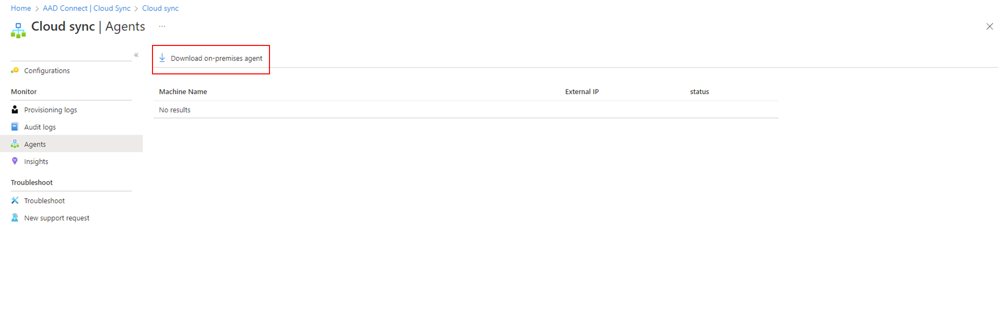

*Screenshot: Download on-premises agent from Entra Admin Center*

### Install the Agent

1. Run `AADConnectProvisioningAgentSetup.exe` from your downloads folder
2. Check the **"I agree to the license terms and conditions"** checkbox
3. Select **Install**
4. Wait for installation to complete - the configuration wizard opens automatically

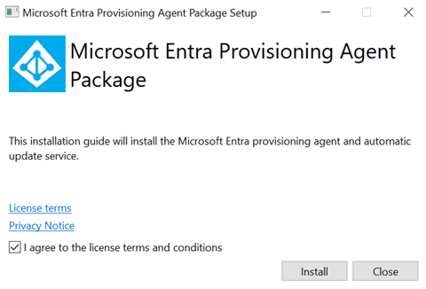

*Screenshot: Agent installation wizard - License terms*

### Configure Service Account (gMSA)

1. On the **Select Extension** screen, select:
   - **HR-driven provisioning (Workday and SuccessFactors) / Microsoft Entra Connect cloud sync**
2. Select **Next**
3. Sign in with your **Microsoft Entra Hybrid Identity Administrator** account
4. On the **Configure Service Account** screen:
   - Select **Create gMSA** (recommended) - creates `provAgentgMSA$` managed service account
   - OR select **Use custom gMSA** if you have a pre-created account
5. If creating gMSA, provide **Active Directory domain administrator credentials**
6. Select **Next**

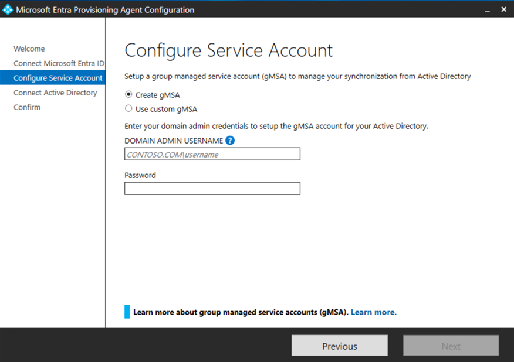

*Screenshot: Configure service account options*

### Connect Active Directory Domain

1. On the **Connect Active Directory** screen:
   - If your domain name appears under "Configured domains", skip to next step
   - Otherwise, enter your **Active Directory domain name**
2. Click **Add directory**
3. Sign in with your **Active Directory domain administrator account**
4. Select **OK**, then **Next**
5. On "Configuration complete" screen, select **Confirm**
6. Wait for agent registration and restart
7. Select **Exit** after verification notification

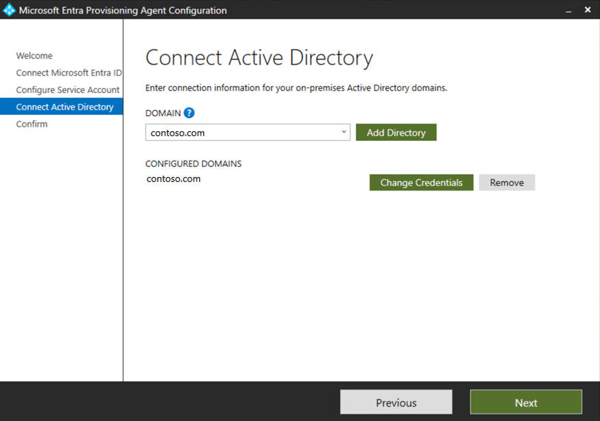

*Screenshot: Connect AD Domain*

### Verify Agent Installation

**In Azure Portal:**
1. Sign in to [Microsoft Entra admin center](https://entra.microsoft.com)
2. Navigate to **Identity** > **Hybrid management** > **Microsoft Entra Connect** > **Cloud sync**
3. Select **Agents**
4. Verify the agent appears with status **"Active"**

**On Local Server:**
1. Open **Services** (run `Services.msc`)
2. Verify both services are present and **Running**:
   - Microsoft Azure AD Connect Agent Updater
   - Microsoft Azure AD Connect Provisioning Agent

**Version Check:**
- Navigate to `C:\Program Files\Microsoft Azure AD Connect Provisioning Agent`
- Right-click `AADConnectProvisioningAgent.exe` > **Properties** > **Details**
- Verify version is **1.1.1107.0 or later** (required for Exchange hybrid writeback)

---

## Part A: Configure via Portal UI

This section walks through configuring Exchange attribute writeback using the **Entra Admin Center** (Portal UI). For the PowerShell approach, see [Part B](#part-b-configure-via-graph-powershell).

### A1. Navigate to Cloud Sync

1. Open the [Preview feature-enabled portal link](https://aka.ms/cloudSyncExchangeAttributeWritebackPreview). This opens the **Microsoft Entra admin center** home page.

   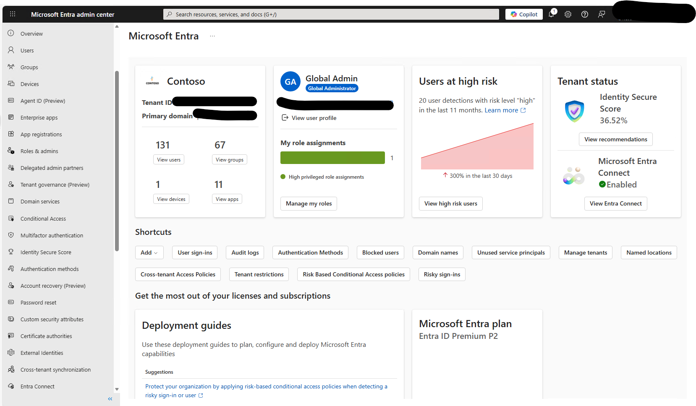

   *Screenshot: Microsoft Entra admin center home page*

2. In the left navigation pane, scroll down and select **Entra Connect**. This opens the **Microsoft Entra Connect | Get started** page. Then select **Cloud Sync** from the left menu.

   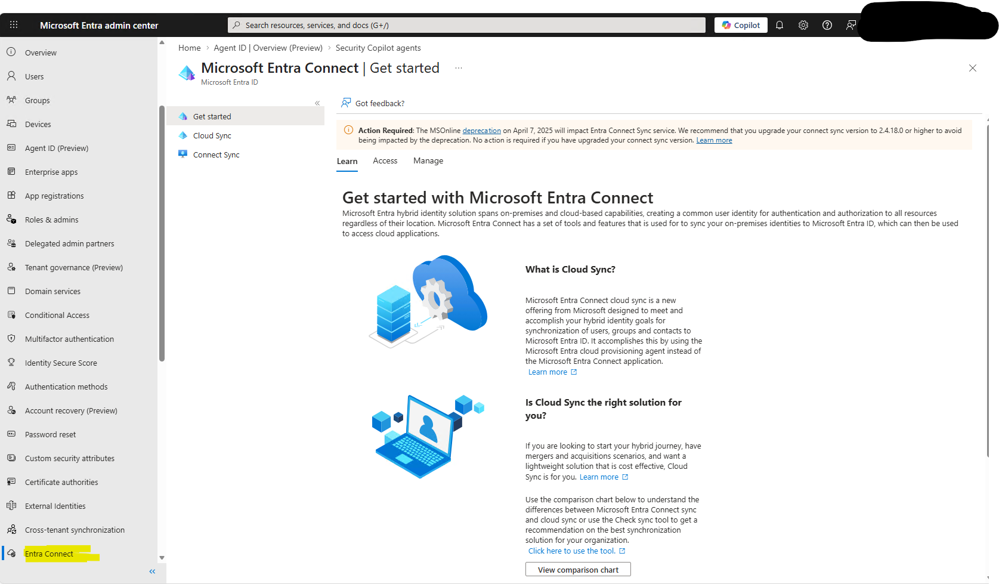

   *Screenshot: Microsoft Entra Connect page — select Cloud Sync from the left menu*

### A2. Create Synchronization Job

3. On the **Cloud sync | Configurations** page, click the **New configuration** dropdown and select **EXO to AD attribute sync**.

   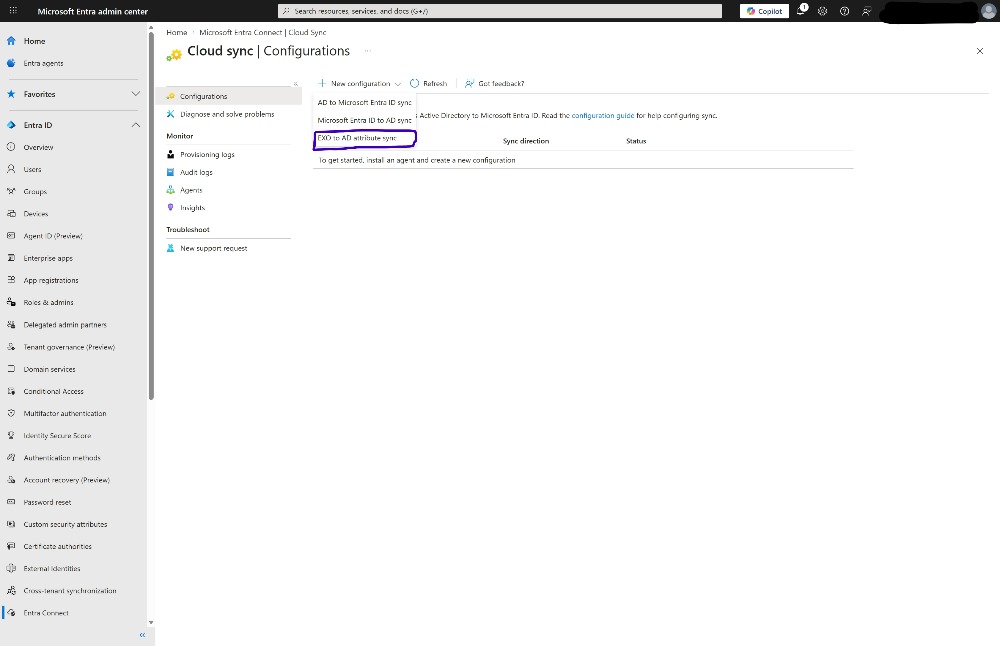

   *Screenshot: Select "EXO to AD attribute sync" from the New configuration dropdown*

4. On the **New Exchange Online Attribute Writeback configuration** page, verify that the agent in the dropdown matches the domain you want to configure sync for, then press **Create** at the bottom of the page. Job creation may take some time.

   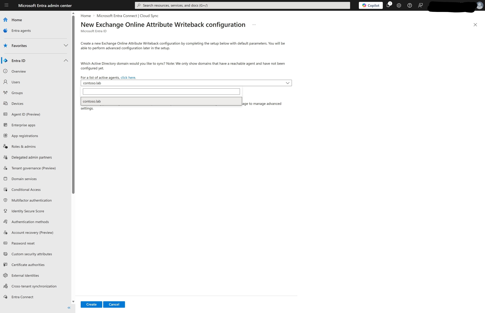

   *Screenshot: New Exchange Online Attribute Writeback configuration — select domain and agent*

5. Once created, the **Overview** page for the new configuration opens automatically.

   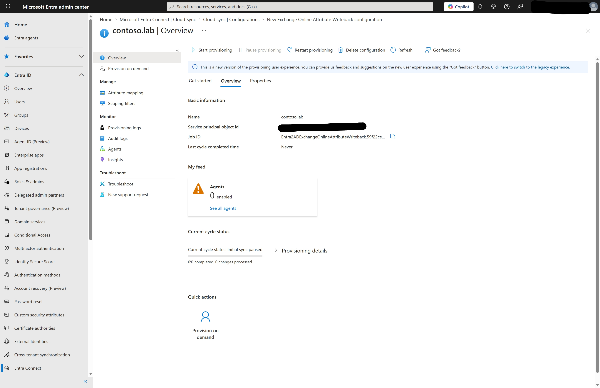

   *Screenshot: Configuration Overview page after job creation*

   You can also reach this page later by clicking on the configuration name in the **Cloud sync | Configurations** list.

   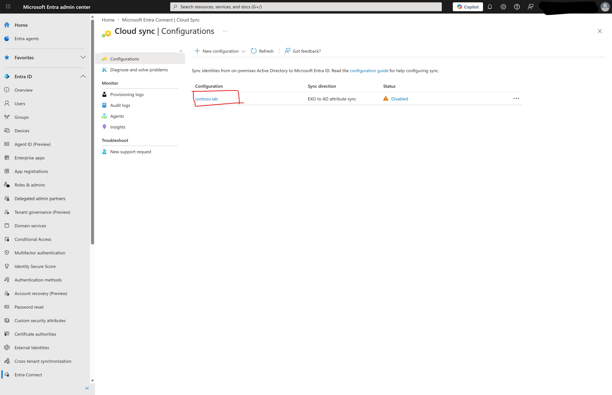

   *Screenshot: Cloud sync Configurations list showing the newly created writeback job*

### A3. Start the Synchronization Job

From the **Overview** tab, press **Start provisioning** to start the job.

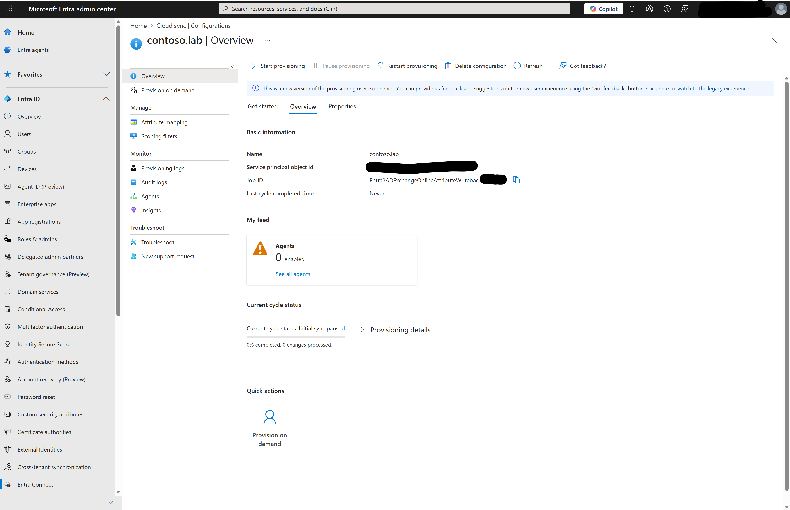

*Screenshot: Overview page — click Start provisioning*

A confirmation dialog appears. Click **Yes** to confirm.

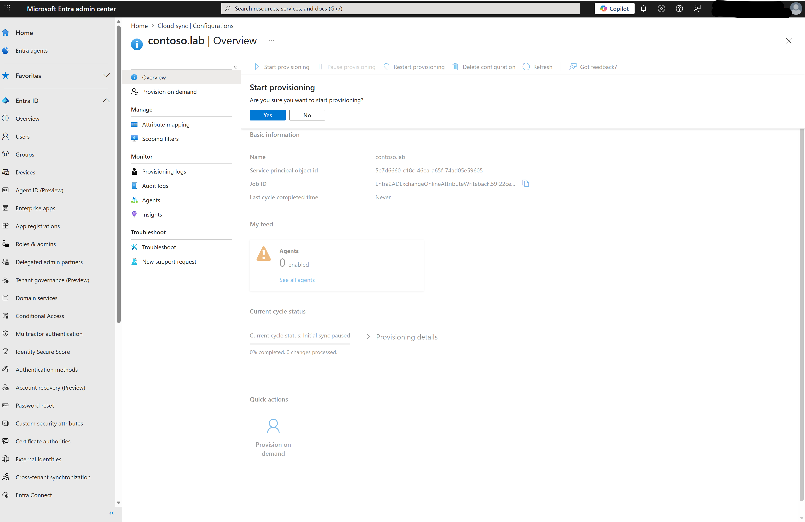

*Screenshot: Start provisioning confirmation dialog*

> [!NOTE]
> After starting the job, allow a few minutes for the initial sync cycle to begin.

### A4. Job Management (Portal)

### Monitor Job Health

You can see the job's overall status in the **Status** column on the **Cloud sync | Configurations** page. Clicking the link in that column opens a sidebar with more details. Opening the configuration itself provides more insights on the **Overview** tab, including:

- **Provisioning logs** — view individual sync operations from the left menu
- **Audit logs** — view configuration changes from the left menu

### Check Writeback of Existing Cloud-Managed Mailboxes

Once the job is running, verify that Exchange attributes for existing `IsExchangeCloudManaged` mailboxes are being written back correctly. Check that current Exchange Online values are reflected in on-premises Exchange Server or Active Directory (see the [Verify Exchange Attribute Writeback](#verify-exchange-attribute-writeback) section below for detailed steps).

### Pause the Synchronization Job

From the **Overview** tab, press **Pause provisioning** to pause the job.

### Delete the Synchronization Job

From the **Overview** tab, press **Delete configuration** to delete the job. Note that this will leave you with an invalid configuration without a job inside. To delete the entire configuration, click the **"..."** menu for the configuration on the right side of the Configurations page, then select **Delete configuration**.

### Manage Attribute Mappings and Scope

With the configuration open, you can view and edit the job's attribute mappings from the **Attribute Mappings** tab, and you can view and edit the job's scoping filters from the **Scoping filters** tab.

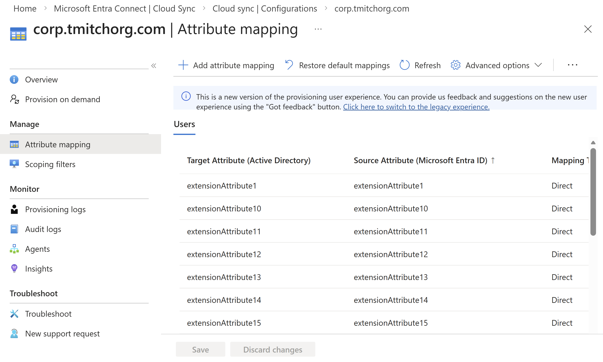

*Screenshot: Manage attribute mappings*

### A5. Provisioning On Demand (Portal)

> [!WARNING]
> The **Provision on demand** UI in the Portal is currently broken, pending fixes which should be deployed in the coming weeks. For now, use the [PowerShell method (B11)](#b11-provisioning-on-demand-powershell) to trigger on-demand provisioning.

The screenshots below show the expected UI once the fix is deployed. From the configuration's left menu, select **Provision on demand**. Search for the user or group you want to sync, then click **Provision**.

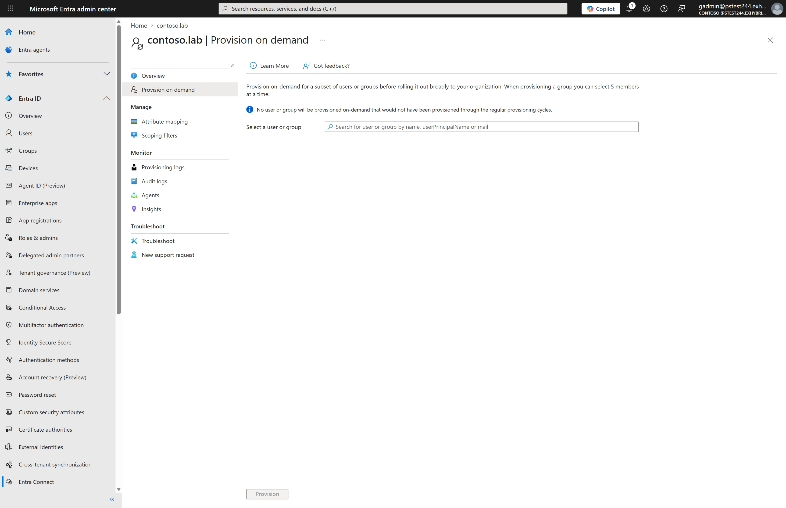

*Screenshot: Provision on demand — search for a user or group*

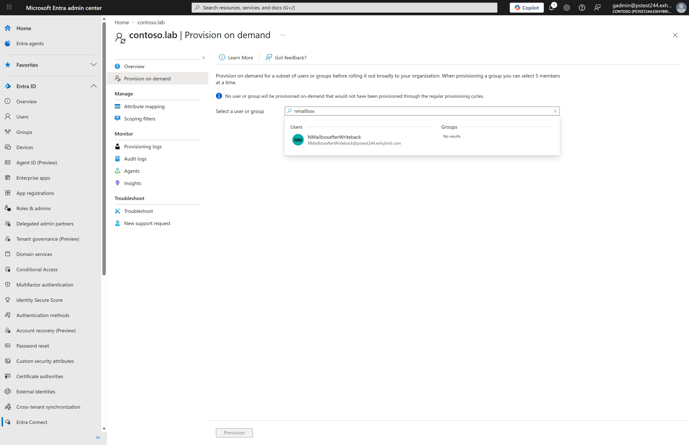

*Screenshot: Provision on demand — user search results*

---

## Part B: Configure via Graph PowerShell

This section walks through configuring Exchange attribute writeback using **Microsoft Graph PowerShell**. For the Portal UI approach, see [Part A](#part-a-configure-via-portal-ui).

### B1. Connect to Microsoft Graph

Open PowerShell and connect with the required scopes:

```powershell
# MS Graph PowerShell
Connect-MgGraph -Scopes "Directory.ReadWrite.All" -NoWelcome
```

### B2. Verify (and Enable) Organization for Sync

```powershell
# MS Graph PowerShell
# Check if on-premises sync is already enabled
$org = Get-MgOrganization
$org | Select-Object DisplayName, OnPremisesSyncEnabled
```

**Expected Output:**
```
DisplayName OnPremisesSyncEnabled
----------- ---------------------
Contoso                      True
```

> **Note:** If you have Entra Connect Sync already installed, `OnPremisesSyncEnabled` will automatically be `True`. In that case, skip to the next step.

If `OnPremisesSyncEnabled` is `False`, enable it:

```powershell
# MS Graph PowerShell
# Only run this if OnPremisesSyncEnabled is False
$params = @{
    onPremisesSyncEnabled = $true
}
Update-MgOrganization -OrganizationId $org.Id -BodyParameter $params
```

### B3. Create Service Principal for Exchange Attribute Writeback

Create a service principal using the Exchange attribute writeback application template:

**Using MS Graph PowerShell:**
```powershell
# MS Graph PowerShell
# Application Template ID for Exchange Online Attribute Writeback
$body = @{
    displayName = "contoso.lab"  # Replace with your AD domain name
} | ConvertTo-Json

$response = Invoke-MgGraphRequest `
   -Method POST `
   -Uri "https://graph.microsoft.com/v1.0/applicationTemplates/3b99513e-0cee-4291-aea8-84356239fb82/instantiate" `
   -Body $body `
   -ContentType "application/json"

$response | ConvertTo-Json -Depth 10
```

**Using Graph Explorer:**
```
POST https://graph.microsoft.com/v1.0/applicationTemplates/3b99513e-0cee-4291-aea8-84356239fb82/instantiate
Content-type: application/json

{
    "displayName": "[your AD domain name here]"
}
```

> **Important:** Save the **Service Principal ID** from the response - you'll need it for subsequent steps.

### B4. Get Service Principal ID

```powershell
# MS Graph PowerShell
# Get the service principal ID (replace domain name with yours)
$servicePrincipalId = Get-MgServicePrincipal -Filter "displayName eq 'contoso.lab'" | Select-Object -ExpandProperty Id
$servicePrincipalId
```

### B5. Create Synchronization Job

**Using MS Graph PowerShell:**
```powershell
# MS Graph PowerShell
$body = @{
   templateId = "Entra2ADExchangeOnlineAttributeWriteback"
} | ConvertTo-Json -Depth 10

$response = Invoke-MgGraphRequest `
   -Method POST `
   -Uri "https://graph.microsoft.com/v1.0/servicePrincipals/$servicePrincipalId/synchronization/jobs" `
   -Body $body `
   -ContentType "application/json"

$response | ConvertTo-Json -Depth 10
```

**Using Graph Explorer:**
```
POST https://graph.microsoft.com/v1.0/servicePrincipals/[SERVICE_PRINCIPAL_ID]/synchronization/jobs
Content-type: application/json

{
    "templateId": "Entra2ADExchangeOnlineAttributeWriteback"
}
```

### B6. Verify Job Creation and Get Job ID

```powershell
# MS Graph PowerShell
# List all synchronization jobs for this service principal
$response = Invoke-MgGraphRequest `
   -Method GET `
   -Uri "https://graph.microsoft.com/beta/servicePrincipals/$servicePrincipalId/synchronization/jobs"

# Extract and store the Job ID
$jobId = $response.value[0].id
$jobId
```

**Expected Output:** A Job ID in the format `Entra2ADExchangeOnlineAttributeWriteback.[unique-id].[unique-id]`

> **Note:** The `$jobId` variable is used in all subsequent steps. If you start a new PowerShell session, you will need to re-run this step to retrieve it.

### B7. Set Synchronization Job Secrets

Configure the on-premises AD domain name:

```powershell
# MS Graph PowerShell
$domainName = "contoso.lab"  # Replace with your AD domain name

$body = @{
    value = @(
        @{
            key   = "Domain"
            value = "{`"domain`":`"$domainName`"}"
        }
    )
} | ConvertTo-Json -Depth 5

$response = Invoke-MgGraphRequest `
   -Method PUT `
   -Uri "https://graph.microsoft.com/beta/servicePrincipals/$servicePrincipalId/synchronization/secrets" `
   -Body $body `
   -ContentType "application/json"
```

### B8. Start the Synchronization Job

```powershell
# MS Graph PowerShell
$response = Invoke-MgGraphRequest `
   -Method POST `
   -Uri "https://graph.microsoft.com/beta/servicePrincipals/$servicePrincipalId/synchronization/jobs/$jobId/start" `
   -ContentType "application/json"
```

**Using Graph Explorer:**
```
POST https://graph.microsoft.com/v1.0/servicePrincipals/[SERVICE_PRINCIPAL_ID]/synchronization/jobs/[JOB_ID]/start
Content-type: application/json
{}
```

### B9. Verify Job Status

```powershell
# MS Graph PowerShell
$response = Invoke-MgGraphRequest `
   -Method GET `
   -Uri "https://graph.microsoft.com/beta/servicePrincipals/$servicePrincipalId/synchronization/jobs/$jobId"

# Job status summary
[PSCustomObject]@{
    JobId            = $response.id
    Status           = $response.status.code
    ScheduleState    = $response.schedule.state
    SyncInterval     = $response.schedule.interval
    LastExecState    = $response.status.lastExecution.state
    UsersInScope     = ($response.status.synchronizedEntryCountByType | Where-Object { $_.key -eq "User to user" }).value
    DomainFQDN       = ($response.synchronizationJobSettings | Where-Object { $_.name -eq "DomainFQDN" }).value
} | Format-List
```

**Expected Output (healthy job):**
```
JobId         : Entra2ADExchangeOnlineAttributeWriteback.[unique-id].[unique-id]
Status        : Active
ScheduleState : Active
SyncInterval  : PT20M
LastExecState : Succeeded
UsersInScope  : 4
DomainFQDN    : contoso.lab
```

> **Key fields to check:**
> - `Status` and `ScheduleState` should both be **Active**
> - `SyncInterval` is **PT20M** (20 minutes between delta sync cycles)
> - `LastExecState` should be **Succeeded**
> - `UsersInScope` shows how many users are in writeback scope

### B10. Job Management (PowerShell)

### Pause the Synchronization Job

```powershell
# MS Graph PowerShell
Invoke-MgGraphRequest `
   -Method POST `
   -Uri "https://graph.microsoft.com/beta/servicePrincipals/$servicePrincipalId/synchronization/jobs/$jobId/pause" `
   -ContentType "application/json"
```

### Delete the Synchronization Job

```powershell
# MS Graph PowerShell
Invoke-MgGraphRequest `
   -Method DELETE `
   -Uri "https://graph.microsoft.com/beta/servicePrincipals/$servicePrincipalId/synchronization/jobs/$jobId"
```

### B11. Provisioning On Demand (PowerShell)

Trigger an immediate sync for a specific user instead of waiting for the delta sync cycle (every 20 minutes). See [provisionOnDemand API](https://learn.microsoft.com/en-us/graph/api/synchronization-synchronizationjob-provisionondemand?view=graph-rest-1.0) ([rate-limited to **5 requests per 10 seconds**](https://learn.microsoft.com/en-us/graph/api/synchronization-synchronizationjob-provisionondemand?view=graph-rest-1.0)).

**1. Get the job's service principal ID and the job ID:** From the **Overview** page of your writeback configuration in the Portal, copy the **Service principal object id** and **Job ID** values. Or, if you followed Part B above, you already have `$servicePrincipalId` and `$jobId` set.

**2. Connect to Microsoft Graph** (if not already connected):

```powershell
# MS Graph PowerShell
Connect-MgGraph -Scopes "Directory.ReadWrite.All" -NoWelcome
```

**3. Set the service principal ID and job ID** (skip if already set from Part B):

```powershell
# MS Graph PowerShell
$servicePrincipalId = "<paste Service principal object id from Portal>"
$jobId = "<paste Job ID from Portal>"
```

**4. Get the user's Entra ID and the rule ID:**

```powershell
# MS Graph PowerShell
$userEntraId = (Get-MgUser -Filter "displayName eq 'CU1'" -Property "id").Id
$schemaUri = "https://graph.microsoft.com/beta/servicePrincipals/" + $servicePrincipalId + "/synchronization/jobs/" + $jobId + "/schema"
$ruleId = (Invoke-MgGraphRequest -Method GET -Uri $schemaUri).synchronizationRules[0].id
```

**5. Trigger on-demand provisioning:**

```powershell
# MS Graph PowerShell
$body = @{
    parameters = @(
        @{
            subjects = @(
                @{
                    objectId = "User_" + $userEntraId
                    objectTypeName = "User"
                }
            )
            ruleId = $ruleId
        }
    )
} | ConvertTo-Json -Depth 10

$podUri = "https://graph.microsoft.com/beta/servicePrincipals/" + $servicePrincipalId + "/synchronization/jobs/" + $jobId + "/provisionOnDemand"
$podResponse = Invoke-MgGraphRequest -Method POST -Uri $podUri -Body $body -ContentType "application/json"
```

**6. Check the result:**

```powershell
# MS Graph PowerShell
$rawValue = $podResponse.value | ConvertFrom-Json
$rawValue.statusInfo
```

**Optional** — view provisioning steps and modified properties:

```powershell
$rawValue.provisioningSteps | Select-Object name, type, status, description | Format-Table -AutoSize -Wrap
$rawValue.modifiedProperties | Select-Object displayName, oldValue, newValue | Format-Table -AutoSize -Wrap
```

**Expected result:** `status: Success` with four provisioning steps:

| Step | Type | Description |
|------|------|-------------|
| EntryImport | Import | Reads the user from Entra ID |
| EntryImport | Matching | Finds the corresponding user in AD |
| EntrySynchronizationScoping | Scoping | Evaluates scoping filters |
| EntryExportUpdate | Export | Writes changed attributes to AD |

---

## Verify Exchange Attribute Writeback

This section applies regardless of whether you used the Portal UI (Part A) or PowerShell (Part B) to configure the writeback job.

## Enable Cloud Management for Test User

Before writeback can work, the test user must have Exchange attributes managed in the cloud:

```powershell
# Exchange Online PowerShell
# Connect to Exchange Online
Connect-ExchangeOnline

# Verify user exists
Get-Mailbox -ResultSize Unlimited | Select-Object Alias, DisplayName

# Enable cloud management for the user
Set-Mailbox -Identity <alias> -IsExchangeCloudManaged $true
```

## Verify User Eligibility

**Find all cloud-managed mailboxes** (useful when you already have users with `IsExchangeCloudManaged = True`):

```powershell
# Exchange Online PowerShell
# List all dir-synced mailboxes that are cloud-managed
Get-Mailbox -Filter "IsDirSynced -eq 'True'" -ResultSize Unlimited | Where-Object { $_.IsExchangeCloudManaged -eq $true } | Select-Object DisplayName, UserPrincipalName, RecipientTypeDetails, IsExchangeCloudManaged | Format-Table -AutoSize
```

**Verify a specific user:**

```powershell
# Exchange Online PowerShell
Get-Mailbox -Identity <alias> | Select-Object DisplayName, IsDirSynced, RecipientType, IsExchangeCloudManaged
```

**Expected values:**
- `IsDirSynced = True`
- `RecipientType = UserMailbox`
- `IsExchangeCloudManaged = True`

## Test Attribute Writeback

1. Modify an Exchange attribute in Exchange Online:

```powershell
# Exchange Online PowerShell
Set-Mailbox -Identity <alias> -CustomAttribute1 "TestValue_$(Get-Date -Format 'yyyyMMdd_HHmmss')"
```

> **Note:** This tests CustomAttribute1. The full list of 23 writeback attributes is documented in the [Attributes Written Back by Cloud Sync](#attributes-written-back-by-cloud-sync) section below.

2. Wait for sync cycle (delta sync runs every ~20 minutes), or use Provisioning On Demand ([Portal — A5](#a5-provisioning-on-demand-portal) | [PowerShell — B11](#b11-provisioning-on-demand-powershell)) to sync immediately.

## Verify Attributes in AD

**Method 1: Using Active Directory Users and Computers**
1. Open **Active Directory Users and Computers**
2. Enable **Advanced Features** (View > Advanced Features)
3. Navigate to the test user
4. Right-click > **Properties** > **Attribute Editor** tab
5. Verify `extensionAttribute1` contains the value set in Exchange Online

**Method 2: Using On-Premises Exchange Management Shell (Recommended)**

This is the ultimate verification - confirming the value is visible in Exchange Server:

```powershell
# On-Premises Exchange Management Shell
Get-RemoteMailbox -Identity <alias> | Select-Object CustomAttribute1, CustomAttribute2, ExtensionCustomAttribute1
```

**Expected Result:** The `CustomAttribute1` value should match what was set in Exchange Online.

---

## Attributes Written Back by Cloud Sync

For the complete list including non-writeback attributes, see [Identity, Exchange Attributes and Writeback](https://learn.microsoft.com/en-us/exchange/hybrid-deployment/enable-exchange-attributes-cloud-management#identity-exchange-attributes-and-writeback).

| AD Attribute | EXO Parameter | Sample EXO Cmdlet |
|--------------|---------------|-------------------|
| extensionAttribute1 | CustomAttribute1 | `Set-Mailbox -Identity <alias> -CustomAttribute1 "value"` |
| extensionAttribute2 | CustomAttribute2 | `Set-Mailbox -Identity <alias> -CustomAttribute2 "value"` |
| extensionAttribute3 | CustomAttribute3 | `Set-Mailbox -Identity <alias> -CustomAttribute3 "value"` |
| extensionAttribute4 | CustomAttribute4 | `Set-Mailbox -Identity <alias> -CustomAttribute4 "value"` |
| extensionAttribute5 | CustomAttribute5 | `Set-Mailbox -Identity <alias> -CustomAttribute5 "value"` |
| extensionAttribute6 | CustomAttribute6 | `Set-Mailbox -Identity <alias> -CustomAttribute6 "value"` |
| extensionAttribute7 | CustomAttribute7 | `Set-Mailbox -Identity <alias> -CustomAttribute7 "value"` |
| extensionAttribute8 | CustomAttribute8 | `Set-Mailbox -Identity <alias> -CustomAttribute8 "value"` |
| extensionAttribute9 | CustomAttribute9 | `Set-Mailbox -Identity <alias> -CustomAttribute9 "value"` |
| extensionAttribute10 | CustomAttribute10 | `Set-Mailbox -Identity <alias> -CustomAttribute10 "value"` |
| extensionAttribute11 | CustomAttribute11 | `Set-Mailbox -Identity <alias> -CustomAttribute11 "value"` |
| extensionAttribute12 | CustomAttribute12 | `Set-Mailbox -Identity <alias> -CustomAttribute12 "value"` |
| extensionAttribute13 | CustomAttribute13 | `Set-Mailbox -Identity <alias> -CustomAttribute13 "value"` |
| extensionAttribute14 | CustomAttribute14 | `Set-Mailbox -Identity <alias> -CustomAttribute14 "value"` |
| extensionAttribute15 | CustomAttribute15 | `Set-Mailbox -Identity <alias> -CustomAttribute15 "value"` |
| msExchExtensionCustomAttribute1 | ExtensionCustomAttribute1 | `Set-Mailbox -Identity <alias> -ExtensionCustomAttribute1 "value"` |
| msExchExtensionCustomAttribute2 | ExtensionCustomAttribute2 | `Set-Mailbox -Identity <alias> -ExtensionCustomAttribute2 "value"` |
| msExchExtensionCustomAttribute3 | ExtensionCustomAttribute3 | `Set-Mailbox -Identity <alias> -ExtensionCustomAttribute3 "value"` |
| msExchExtensionCustomAttribute4 | ExtensionCustomAttribute4 | `Set-Mailbox -Identity <alias> -ExtensionCustomAttribute4 "value"` |
| msExchExtensionCustomAttribute5 | ExtensionCustomAttribute5 | `Set-Mailbox -Identity <alias> -ExtensionCustomAttribute5 "value"` |
| msExchRecipientDisplayType | Type | N/A — updated automatically when mailbox type changes |
| msExchRecipientTypeDetails | Type | `Set-Mailbox -Identity <alias> -Type Shared` |
| proxyAddresses | EmailAddresses | `Set-Mailbox -Identity <alias> -EmailAddresses @{Add="smtp:alias@domain.com"}` |
| proxyAddresses | WindowsEmailAddress | `Set-Mailbox -Identity <alias> -WindowsEmailAddress "new@domain.com"` |

---

## Important Warnings and Recommendations

> **Offboarding Warning:**
> Before migrating a mailbox back to on-premises, you **MUST** set `IsExchangeCloudManaged` to `$false`. Failure to do so may cause synchronization conflicts where cloud and on-premises values compete for authority.
>
> ```powershell
> # Exchange Online PowerShell
> # ALWAYS run this BEFORE migrating mailbox back on-premises
> Set-Mailbox -Identity <alias> -IsExchangeCloudManaged $false
> ```

> **Backup Before Rollback:**
> Before reverting SOA to on-premises (setting `IsExchangeCloudManaged = $false`), backup any cloud modifications that are not in the writeback scope. These non-writeback attributes will be overwritten by on-premises values during the next sync cycle. Export the mailbox properties first:
>
> ```powershell
> # Exchange Online PowerShell
> # Backup mailbox properties before rollback
> Get-Mailbox -Identity <alias> | Export-Csv -Path "MailboxBackup_$(Get-Date -Format 'yyyyMMdd').csv" -NoTypeInformation
> ```

---

## Troubleshooting Tips

> **Bug Reporting:** If you encounter bugs or unexpected behavior with the Exchange attribute writeback feature, please report to: **Mukesh**

| Issue | Resolution |
|-------|------------|
| Agent status not Active | Check Windows services are running; verify network connectivity; restart services if needed |
| Attributes not writing back | Verify user has `IsExchangeCloudManaged = True`; check provisioning logs in the Portal |
| First-time users not syncing | Delta sync only processes existing users - first-time users require an initial sync cycle |
| Sync delays | Delta sync runs every ~20 minutes (PT20M interval); wait for the next cycle |
| Job creation fails in Portal | Verify the agent is active and matches the correct domain; check browser console for errors |
| Service Principal creation fails (PowerShell) | Verify you have `Directory.ReadWrite.All` permissions |
| Job creation fails (PowerShell) | Verify Service Principal ID is correct; check template ID spelling |
| Job status shows error | Check job secrets (domain name); verify agent connectivity; check provisioning and audit logs |

---

## References

- [Exchange hybrid writeback with Cloud Sync](https://learn.microsoft.com/en-us/entra/identity/hybrid/cloud-sync/exchange-hybrid)
- [Cloud-managed Exchange attributes](https://learn.microsoft.com/en-us/exchange/hybrid-deployment/enable-exchange-attributes-cloud-management)
- [Cloud Sync Prerequisites](https://learn.microsoft.com/en-us/entra/identity/hybrid/cloud-sync/how-to-prerequisites)
- [Provisioning Agent Installation](https://learn.microsoft.com/en-us/entra/identity/hybrid/cloud-sync/how-to-install)
- [Cloud Sync Configuration](https://learn.microsoft.com/en-us/entra/identity/hybrid/cloud-sync/how-to-configure)
